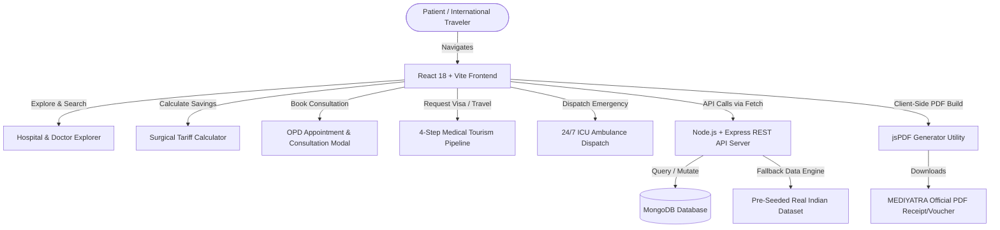

# 🏥 MEDIYATRA — Global Healthcare Network & Medical Tourism Concierge Platform

> **Accelerating Tertiary Surgical Care, Transparent Hospital Tariffs, and End-to-End International Patient Facilitation across Accredited Healthcare Centers in India.**

[](https://react.dev/)
[](https://nodejs.org/)
[](https://www.mongodb.com/)
[](https://tailwindcss.com/)
[](#license)

---

## 🌟 Executive Summary

**MEDIYATRA** is a state-of-the-art, full-stack healthcare web application designed to connect domestic and international patients with premier, JCI (Joint Commission International) and NABH (National Accreditation Board for Hospitals & Healthcare Providers) accredited quaternary hospital networks across India.

The platform eliminates opacity in global medical travel by offering **verified hospital datasets**, **direct board-certified doctor consultation schedules**, **transparent all-inclusive surgical package tariffs**, a **4-Step Medical Tourism Visa Pipeline**, an **isolated Patient Health Portal**, **instant client-side PDF receipt generation**, and a **24/7 ICU Emergency SOS Ambulance Dispatch system**.

---

## 🚀 Key Features & Service Modules

### 🏥 1. Accredited Hospital Explorer
* **Verified Indian Quaternary Dataset**: Pre-seeded with 26 verified premier hospitals across India (Indraprastha Apollo, Max Super Speciality Saket, Fortis Escorts Heart Institute, Medanta The Medicity, Artemis Gurugram, BLK-Max, Narayana Health, Manipal Hospitals, Kokilaben Dhirubhai Ambani, Tata Memorial Centre, etc.).
* **Factual Clinical Attributes**: Displays verified bed counts, ICU ratios, accreditation tags (JCI, NABH, ISO), emergency trauma capability, and exact geographic coordinates.
* **Side-by-Side Hospital Comparison**: Interactive comparison modal evaluating up to 3 hospitals across 8 metrics.
* **Interactive Location Maps**: Live modal rendering exact Google Maps embeds, nearest international airport distance (DEL, BOM, MAA), and transit times.

### 👨‍⚕️ 2. Board-Certified Doctor Directory
* **Senior Medical Faculty**: Profile pages for Padma Awardees, FRCS/FACC certified department chairs, and robotic surgical specialists.
* **OPD & Video Consultation Fee Transparency**: Clear breakdown of consultation charges in both USD ($) and INR (₹).
* **Direct Clinical Messaging**: Integrated consultation request workflow allowing patients to submit medical histories and diagnostic files directly to senior specialists.

### 💰 3. Surgical Tariff & Cost Calculator
* **Full Price Transparency**: Compares verified all-inclusive surgical package tariffs in India against US/UK hospital averages with **savings up to 85%**.
* **Covers Key Specialties**: Cardiac Surgery (CABG, Valve Replacement), Orthopaedics (Total Knee/Hip Replacement), Oncology (Prostatectomy, Mastectomy), Neurosurgery (Brain Tumor Resection), and Organ Transplants.
* **Live Currency Converter**: Instant toggle between USD ($) and INR (₹).

### ✈️ 4. Live 4-Step Medical Tourism Pipeline
A structured workflow managing international patient travel:
1. **Step 1 — Patient Request**: Request Fast-Track e-Medical Visa Invitation Letters (VIL), certified multilingual interpreters (Arabic, Russian, French, Bengali), serviced recovery guest suites, and airport wheelchair transfers.
2. **Step 2 — Hospital Approval**: Host hospital issues official embassy invitation letters.
3. **Step 3 — Admin Logistics Dispatch**: Platform admins assign certified interpreters, book guest suites, and schedule airport pickup drivers.
4. **Step 4 — Doctor Evaluation**: Attending department chairs review pre-travel diagnostic scans and issue preliminary treatment plans.

### 👤 5. Session-Isolated Patient Health Portal
* **Protected Case Management**: Authenticated patient accounts privately track live doctor consultations, appointment requests, diagnostic lab reports, medical records, and digital prescriptions.
* **Multi-Tab Navigation**: Clean sub-navigation separating active tourism cases, doctor responses, lab scans, and active prescriptions.

### 📄 6. Client-Side PDF Receipt & Voucher Generator (`jsPDF`)
* Generates formatted, high-resolution `.pdf` documents directly in the browser without server latency.
* **Included Document Types**:
  * OPD Appointment Confirmation Vouchers
  * Specialist Doctor Consultation Slips
  * e-Medical Visa Invitation Vouchers
  * Emergency 24/7 ICU Ambulance Dispatch Receipts
  * Diagnostic Lab & Prescription Reports
* Features official MEDIYATRA branding headers, reference barcodes, patient details, financial breakdowns, and verification stamps.

### 🤝 7. Philanthropic Charity & Equipment Aid Hub
* **Surplus Medical Aid Registry**: Donors and verified healthcare foundations list surplus wheelchairs, oxygen concentrators, hospital beds, and surgical supplies.
* **Patient Grants**: Underprivileged patients submit requests for financial medical grants supported by verified health NGOs.

### 🚨 8. 24/7 ICU SOS Emergency Ambulance Dispatch
* **One-Touch Trauma Dispatch**: Instant ambulance booking interface capturing pickup location, contact phone, and medical emergency classification (Cardiac Arrest, Trauma, Respiratory Distress).
* Displays real-time driver details and estimated life-support unit arrival time.

### 🛡️ 9. Multi-Role Access Control (RBAC) & Admin Operations
* Specialized operational dashboards for **Patients**, **Doctors**, **Hospitals**, and **System Administrators**.
* **Admin Operations**: User account status toggles, NGO verification approvals, hospital/doctor CRUD management, and logistics dispatch monitoring.

---

## 🛠️ Technology Stack

| Layer | Technology | Details |
| :--- | :--- | :--- |
| **Frontend Framework** | React 18 (`react`, `react-dom`) | Functional component architecture with Hooks state management. |
| **Build System** | Vite 5 | Fast HMR (Hot Module Replacement) and optimized Rollup production bundler. |
| **Styling & Design** | Vanilla CSS + Tailwind CSS 3 | Modern aesthetics: dark glassmorphism, curated HSL color palettes, responsive flexbox/grid. |
| **Iconography** | Lucide React | Modern vector icon suite (`lucide-react`). |
| **PDF Generation** | jsPDF (`jspdf`) | Dynamic client-side binary PDF document builder. |
| **Backend Runtime** | Node.js (v18+) | Asynchronous event-driven JavaScript server runtime. |
| **Web Framework** | Express.js | RESTful API routing, middleware, and request handling. |
| **Database & ORM** | MongoDB & Mongoose | Document-oriented NoSQL database with strictly typed Mongoose schemas. |
| **Authentication** | JSON Web Tokens (JWT) & bcrypt.js | Password hashing and secure token-based authorization. |

---

## 📊 System Architecture & Workflow



---

## ⚙️ REST API Reference Documentation

### 🏥 Hospital & Doctor Endpoints

| Method | Endpoint | Description | Access |
| :--- | :--- | :--- | :--- |
| `GET` | `/api/hospitals` | Fetch all accredited hospital listings with city & specialty filters | Public |
| `GET` | `/api/hospitals/:id` | Get detailed hospital profile by ID | Public |
| `POST` | `/api/hospitals` | Create a new hospital entry | Admin / Hospital |
| `GET` | `/api/doctors` | Fetch board-certified doctor directory | Public |
| `GET` | `/api/doctors/:id` | Get doctor profile details | Public |
| `POST` | `/api/doctors` | Add a new specialist to directory | Admin / Doctor |

### 📅 Appointment & Consultation Endpoints

| Method | Endpoint | Description | Access |
| :--- | :--- | :--- | :--- |
| `GET` | `/api/appointments` | Fetch appointments (supports `patientEmail` query filter) | Authenticated |
| `POST` | `/api/appointments` | Book a new OPD hospital consultation appointment | Public / Patient |
| `PATCH` | `/api/appointments/:id/status` | Update appointment status (`Confirmed`, `Completed`, `Cancelled`) | Admin / Doctor |
| `GET` | `/api/consultations` | Fetch doctor consultation inquiries | Authenticated |
| `POST` | `/api/consultations` | Submit medical case inquiry to department chair | Public / Patient |
| `PATCH` | `/api/consultations/:id/respond` | Doctor submits clinical response notes | Doctor / Admin |

### ✈️ Medical Tourism & Logistics Endpoints

| Method | Endpoint | Description | Access |
| :--- | :--- | :--- | :--- |
| `GET` | `/api/tourism` | Fetch medical tourism pipeline orders | Authenticated |
| `POST` | `/api/tourism` | Initiate Step 1 Tourism Request (e-Visa VIL, Translator, Suite, Airport) | Public / Patient |
| `PATCH` | `/api/tourism/:id/hospital-approve` | Step 2: Host hospital approves Visa Invitation Letter | Hospital / Admin |
| `PATCH` | `/api/tourism/:id/admin-dispatch` | Step 3: Admin dispatches travel logistics & interpreters | Admin |

### 🚨 Emergency SOS & Charity Aid Endpoints

| Method | Endpoint | Description | Access |
| :--- | :--- | :--- | :--- |
| `POST` | `/api/ambulance/dispatch` | Dispatch 24/7 ICU Ambulance unit | Public |
| `GET` | `/api/ngo` | Fetch registered healthcare NGO foundations | Public |
| `PATCH` | `/api/ngo/:id/verify` | Admin verifies NGO listing | Admin |
| `GET` | `/api/equipment` | Fetch surplus medical equipment donation registry | Public |

---

## 📂 Directory Structure

```
MediYatra/
├── backend/
│   ├── config/
│   │   └── db.js                 # MongoDB Mongoose Connection Setup
│   ├── controllers/              # Express Controller Logic (Auth, Hospital, Doctor, Tourism, etc.)
│   ├── models/                   # Mongoose Data Schemas (Hospital.js, Doctor.js, Appointment.js, etc.)
│   ├── routes/                   # REST API Endpoint Routers
│   ├── seeders/                  # Seed Script for Verified Real Indian Hospital Dataset
│   ├── server.js                 # Express Application Entry Point
│   └── package.json
│
├── frontend/
│   ├── public/
│   │   ├── favicon.ico
│   │   └── logo_clean.png        # Official Brand Emblem
│   ├── src/
│   │   ├── components/
│   │   │   ├── Navbar.jsx        # Navigation Header Ribbon & Topbar
│   │   │   ├── HeroSection.jsx   # Home Landing Banner & Portal Cards
│   │   │   ├── HospitalExplorer.jsx # Quaternary Hospital Directory & Photo Hero
│   │   │   ├── DoctorDirectory.jsx  # Specialist Directory & Consultation Schedules
│   │   │   ├── TreatmentCostCalculator.jsx # Surgical Tariff & International Savings Calculator
│   │   │   ├── MedicalTourismHub.jsx   # 4-Step Visa & Travel Concierge Hub
│   │   │   ├── PatientRecordsPortal.jsx # Session-Isolated Health Portal
│   │   │   ├── CharityAidHub.jsx       # NGO Aid & Equipment Donation Hub
│   │   │   ├── HospitalMapModal.jsx    # Live Google Maps Location Embed
│   │   │   ├── HospitalCompareModal.jsx# Side-by-Side Hospital Metric Evaluator
│   │   │   ├── AuthModal.jsx           # User Sign In & Registration Modal
│   │   │   ├── AppointmentModal.jsx    # OPD Booking Modal
│   │   │   ├── ConsultationModal.jsx   # Doctor Consultation Request Modal
│   │   │   ├── TourismBookingModal.jsx  # Medical Tourism Step 1 Request Modal
│   │   │   ├── EmergencySOSModal.jsx   # 24/7 ICU Ambulance Dispatch Modal
│   │   │   ├── AITriageWidget.jsx      # Clinical Symptom Triage Desk
│   │   │   ├── AdminDashboard.jsx      # System Operations & Analytics Panel
│   │   │   └── Footer.jsx              # Responsive Footer Navigation
│   │   ├── data/
│   │   │   └── mockData.js       # Pre-Seeded Real Hospital Fallback Dataset
│   │   ├── services/
│   │   │   └── api.js            # Frontend REST API Fetch Service
│   │   ├── utils/
│   │   │   └── pdfGenerator.js   # jsPDF Client-Side Receipt & Voucher Generator
│   │   ├── App.jsx               # Root Application Router & State Manager
│   │   ├── main.jsx              # Vite React DOM Rendering Entry Point
│   │   └── index.css             # Tailwind CSS & Global Styling Utility Rules
│   ├── package.json
│   └── vite.config.js            # Vite Development & Rollup Production Config
└── README.md
```

---

## ⚡ Quick Start & Local Development Setup

### Prerequisites
* **Node.js**: v18.0.0 or higher
* **npm**: v9.0.0 or higher
* **MongoDB** *(Optional)*: Local MongoDB instance (`mongodb://localhost:27017`) or Atlas connection string. *(The application automatically falls back to an in-memory offline mock engine if MongoDB is not running).*

### 1. Clone Repository
```bash
git clone https://github.com/CoderXNavi/MediYatra.git
cd MediYatra
```

### 2. Backend Setup & Run
```bash
cd backend
npm install
npm run seed     # Optional: Seeds MongoDB with 26 real accredited Indian hospitals
npm run dev      # Starts Express server on http://localhost:5000
```

### 3. Frontend Setup & Run
Open a new terminal window:
```bash
cd frontend
npm install
npm run dev      # Starts Vite dev server on http://localhost:5173
```

### 4. Open in Browser
Visit **`http://localhost:5173/`** to interact with the live application!

---

## 📜 License

Distributed under the **MIT License**. See `LICENSE` for details.

---

<p center>
  <b>MEDIYATRA Healthcare Network</b> • Saket, New Delhi, India<br>
  <i>Connecting Health, Facilitating Care.</i>
</p>
